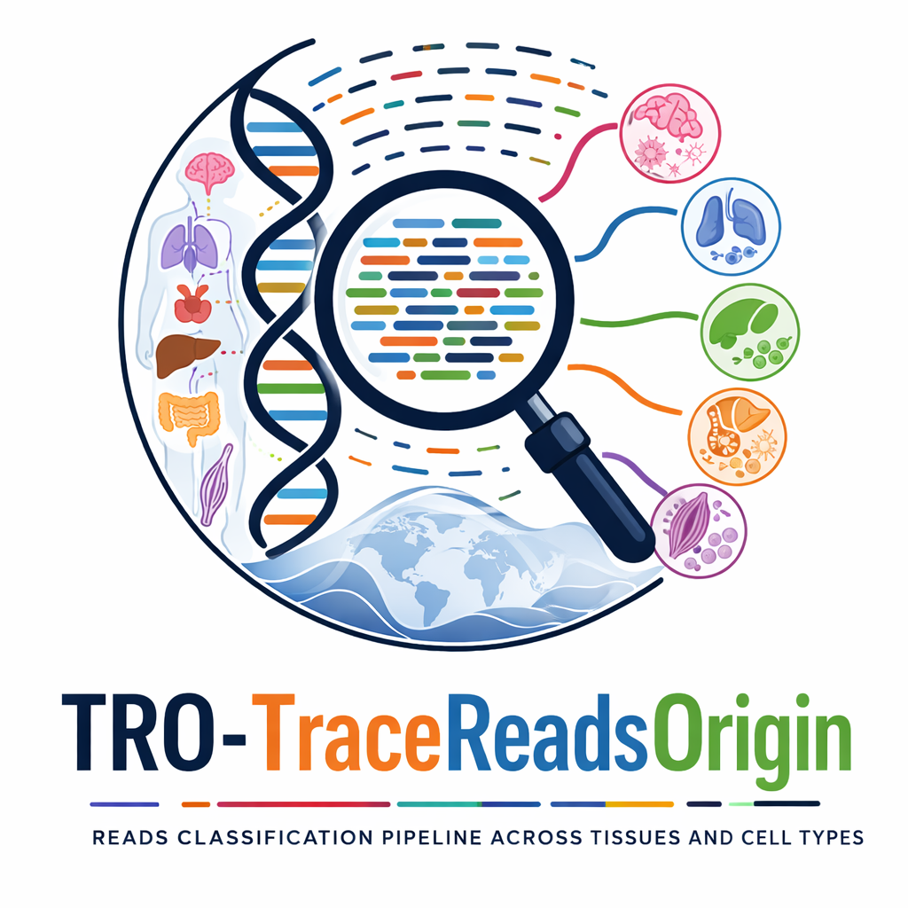

# TRO (Trace Reads Origin) Pipeline

<p align="center">
  
</p>

A reproducible Nextflow DSL2 pipeline for classifying long-read DNA methylation data into tissue and cell-type fractions using pre-trained methylation models.

This pipeline is designed for HPC environments and runs out-of-the-box using a pre-built Singularity (Apptainer) image — no Docker, no Conda setup required for end users.

⸻

## 🚀 Key Features
- End-to-end methylation based long-read  classification workflow
- Chunked BAM processing for massive scalability
- Dynamic resource allocation and automatic Out-Of-Memory (OOM) recovery
- Works on Slurm, PBS, or local execution
- Fully containerized with Singularity
- Generates interactive Plotly Sunburst diagrams for compositional fractions
- Minimal user inputs (just a CSV)

⸻

## 📂 Repository Structure

```text
readsClassification_nextflow_zarr/
├── main.nf                    # Pipeline logic (DSL2)
├── nextflow.config            # Configuration, profiles, parameters
├── conf/                      # Scheduler-specific configs (slurm / pbs)
├── bin/                       # Pipeline scripts (Python / R / Bash)
├── assets/                    # Reference & training data
│   ├── training_data/
│   ├── methylation_clustering/
│   └── references/
├── containers/                # Singularity image & definition file
│   └── readsClassification.sif
├── envs/                      # Conda environment definition (build-time only)
├── data/                      # Optional small example data
│   └── example/
│       ├── COLO829BL_random1pct.bam
│       ├── COLO829BL_random1pct.bam.bai
│       └── samples.csv
├── results/                   # Pipeline outputs
├── work/                      # Nextflow work directory (auto-generated)
└── README.md
```

⸻

## 🧬 Required Inputs

**1. Sample sheet (CSV)**

The pipeline requires a CSV file with at least two columns (`sampleID` and `bam`):

```csv
sampleID,bam
sample1,/full/path/to/sample1.bam
sample2,/full/path/to/sample2.bam
```

**Notes:**
- BAM must be coordinate-sorted
- BAM must be indexed (a corresponding `.bam.bai` must be present next to it)
- Use absolute paths (highly recommended)


⸻

📚 Reference & Training Data for hg38 (already present in : `assets/` directory, no need to mention in input command)

The following reference and training files are bundled with the pipeline (assets/ directory):

- Training methylation counts data per CpG site (Zarr format) for hg38 :
` ThirtyThreeTissues_75SubCells_Mh_Binomial_parameters_Cov.gt5.sorted.bed.zarr `
- Cell-type clustering metadata (Excel file) :
`nodes_with_leaves_mannual.xlsx`
- Reference genome hg38 (FASTA):
`GRCh38_no_alt_analysis_set_GCA_000001405.15.fasta`


No additional downloads are required, if you use same setup (training methylation data + hirarchial clustering of celltypes ) used in for our publication .

### Training data formats

- Training methylation counts data per CpG site (Zarr format) :
The training data is in Zarr format, which is a format for storing chunked, compressed N-dimensional arrays. It is a binary format and is not human-readable.  The file used to create the Zarr file is `ThirtyThreeTissues_75SubCells_Mh_Binomial_parameters_Cov.gt5.sorted.bed.gz` using `bin/bed_to_zarr.py`script and sample of this file (first 5 rows) is given below:

```console
>> zcat pathTo/ThirtyThreeTissues_75SubCells_Mh_Binomial_parameters_Cov.gt5.sorted.bed.gz | head -n5 | awk '{print $1, $2, $3, $4, $5, $6, $7, $8}' | column -t

#chrom  start  end    CpG_ind  Adipocytes-FatCells  Aorta-Endothel  Aorta-SmoothMuscle  Bladder-Epithelial
chr1    10562  10563  9        47:12                15:2            10:5                53:14
chr1    10570  10571  10       50:11                15:1            13:4                63:5
chr1    10576  10577  11       36:25                16:0            12:7                47:21
chr1    10578  10579  12       33:32                10:6            11:7                49:19

```

- Cell-type clustering metadata (Excel file) :


⸻

## ⚙️ Execution Parameters

### **Help** 
```console
nextflow run main.nf --help
```

### 1. Essential Parameters
These parameters are **required** for every run. The pipeline cannot start without a valid input file.


| Parameter | Type | Required | Description |
| :--- | :--- | :---: | :--- |
| `--input` | File | ✅ Yes | Path to your metadata CSV file. |

### 2. Default Reference Parameters
These are **required** but come with pre-configured defaults. You only need to specify these if you are using custom reference files or a different genome assembly.


| Parameter | Type | Default Value | Description |
| :--- | :--- | :--- | :--- |
| `--genomeAssembly` | String | `hg38` | Genome assembly name (e.g., `hg38`, `hg19`). |
| `--trainData` | File | `assets/training_data/...` | Path to training data (zarr format) for hg38 cell types. |
| `--CellTypeGroupsFile` | File | `assets/methylation/...` | Path to methylation-based cell type groups file (Excel). |
| `--genomeFasta` | File | `assets/references/...` | Path to reference hg38 genome FASTA file. |

### 3. Optional Parameters
These parameters are **optional**. Use them to control where the pipeline runs, where it saves data, and how it notifies you.


| Parameter | Type | Description |
| :--- | :--- | :--- |
| `-resume` | Flag | Resumes the previous job if it stopped due to an error or interruption. |
| `-profile` | String | Execution profile to use: `slurm`, `pbs`, or `local`. |
| `--account` | String | HPC allocation/project handle (e.g., `--account myproject`). |
| `--outputDir` | Path | Output directory. Defaults to `${projectDir}/results`. |
| `--email` | String | Email address for run completion/failure notifications. |


### 4. Nextflow Core Options
Standard Nextflow command-line options (passed to `nextflow run`) can also be used:

| Parameter | Type | Description |
| :--- | :--- | :--- |
| `-w` / `-work-dir` | Path | Specify the directory where intermediate workflow files are stored (defaults to `./work`). |
| `-c` | File | Add a custom configuration file to the run. |
| `-bg` | Flag | Run Nextflow in the background. |

For a complete list of core Nextflow options, you can run:
```console
nextflow run -h
```


⸻

## ▶️ Running the Pipeline

#### 🧱 Containerized Execution (Recommended)

A pre-built Singularity image is provided: `containers/readsClassification.sif`

This image contains:
- Python + required libraries (pysam, numpy, pandas, etc.)
- R + required packages
- All system dependencies

✅ Users do NOT need Docker or Conda

⸻

#### 📦 Example Data

Small test data  placed under: `data/example`

Recommended for:

- Quick validation
- CI testing
- New user onboarding
        
⸻


#### **Local execution (Testing)**
```console
nextflow run main.nf --input data/example/samples.csv
```

#### **Slurm Cluster (Production)**
```console
nextflow run main.nf \
  -profile slurm \
  --input data/example/samples.csv \
  --outputDir pathTo/outDir \
  --account myproject \
  --email user@email.com
```
If there are > 10 samples, them submit using `sbatch submit.sh` script and track run using `tail -f nf_head.log`. if run timed out then re-run command with ´-resume´ option to start from it exited before.
```console
sbatch --time=30:00:00  submit.sh  \
  nextflow run main.nf  \
    -profile slurm -resume \
    --input data/example/samples.csv \
    --outputDir pathTo/outDir \
    --account myproject \
    --email user@email.com
```
#### **PBS Cluster (Testing) **
```console
nextflow run main.nf \
  -profile pbs \
  --input data/example/samples.csv \
  --account myproject \
  --email user@email.com
```

### How to Run Jobs Concurrently

Nextflow creates a default `work/` directory in the current directory, and if you run the pipeline multiple times simultaniously in the same directory, it will create a new `work/` directory each time, which can cause conflicts. This conflicts can be avoided by any of the below options:

#### **Option 1: Using separate launch directories for each run.**

```console
# Create separate environments
mkdir -p runs/run1 runs/run2

# Start first job (Terminal 1)
cd runs/run1
nextflow run /path/to/main.nf -profile ..

# Start second job (Terminal 2)
cd runs/run2
nextflow run /path/to/main.nf -profile ..
```

#### **Option 2: Using separate work directories for each run.**

Specify a different work directory using the `-w` or `-work-dir` option. 

For example:
```console
nextflow run /path/to/main.nf -w work1 ...
nextflow run /path/to/main.nf -w work2 ...
```

### Utility Functions

#### **Extract classified Reads** 

Filter classified reads by log-likelihood difference threshold and/or by cell type or tissue type or by custom groups.

**Help**
```console
nextflow run main.nf -entry EXTRACT_READS --help
```

**Example**
```console
nextflow run main.nf \
  -profile slurm \
  -entry EXTRACT_READS \
  --input_dir <path (required): pathTo/sample/05_ReadsClassification/FracVsThresh/> \
  --threshold <Integer (default: 10)> \
  --group <name (default: Somatic)> \
  --outdir <path (required)> \
  --nodefile <path (default: assets/methylation_clustering/nodes_with_leaves_mannual.xlsx)> \
  --account <project account (optional)> \
  --email <email (optional)>
```


#### **Preprocessing of training data (Optional)** 

Use only if custom training data is used.

**Help**
```console
nextflow run main.nf -entry PREPARE_ZARR --help
```

**Example**
```console
nextflow run main.nf \
  -profile slurm \
  -entry PREPARE_ZARR \
  --bed <path> \
  --zarr_out <path> \
  --account <project account (optional)> \
  --email <email (optional)>
```

**Example input BED file format (`--bed`):**
```tsv
#chrom  start  end    CpG_ind  Adipocytes-FatCells  Sperm-spermatids
chr1    10562  10563  9        47:12                0:34
chr1    10570  10571  10       50:11                2:34
chr1    10576  10577  11       36:25                0:37
chr1    10578  10579  12       33:32                0:35
chr1    10588  10589  13       54:13                3:24
chr1    10608  10609  14       64:12                1:33
chr1    10616  10617  15       68:8                 0:32
chr1    10649  10650  23       58:13                4:59
chr1    10659  10660  24       61:15                2:62
```


⸻

## 🔄 Internal Process Workflow

### Nextflow Processes 
The pipeline automatically handles the following steps in sequence:

1. **`split_bam`**: Splits large input BAM files into manageable genomic chunks based on chromosomes.
2. **`MethyperCpG_forReads_chunk`**: Extracts CpG-level methylation arrays from the long read chunks using `02_MethyperCpG_forLongReads.py`.
3. **`generate_methy_freq_table`**: Generates a high-fidelity reference methylation frequency table per sample.
4. **`estimate_parameters`**: Fits Beta distributions to the methylation frequencies via a Genetic Algorithm to output statistical parameters.
5. **`calculate_reads_likelihood`**: Calculates the likelihood score of each read for every celltype using their methylated and unmethylated counts. The methylated and unmethylated counts for each genomic CpG site were in bed format. Which was converted to zarr format for better reading and memory management.  (`04_Reads_likelihood_InTissueCellTypes.py`).
6. **`merge_likelihood_results`**: Merges all computed likelihood chunks back into a single comprehensive matrix per sample.
7. **`reads_classification`**: Classifies reads into cell types mapped against a provided hierarchical tree (`05_ReadsClassification.R`).
8. **`cellType_FractionPlots`**: Generates interactive HTML Sunburst plots showing compositional cell type fractions at various hard threshold cutoffs (`06_CellTypeFraction_SunburstPlot.py`).


<iframe src="dag.html" width="100%" height="800px" frameborder="0" style="border:none;"></iframe>


<!-- 
<a href="https://htmlpreview.github.io/?https://github.com/vinodsinghjnu/ReadsClasification_NextFlow_Readme/blob/main/dag.html" target="_blank" rel="noopener noreferrer">👉 <b>Click here to view the DAG of pipeline!</b></a>
-->


### 🛠 Resource & Error Management
- The pipeline utilizes automatic **dynamic resource allocation** for memory-intensive jobs.
- If a task like `calculate_reads_likelihood` or `reads_classification` runs out of memory (OOM `exitCode 137`), Nextflow will automatically intercept the failure and **retry the job while dynamically increasing (doubling) the requested RAM**.

⸻

## 📤 Outputs

Results are written incrementally to: `results/[sampleID]/`

### **Output Files**


- `01_BAMChunks/`: Intermediate BAM chunks.
- `02_ReadsMethyperCpG/`: Methylation value per GpG site of the read.
- `03_CpG_priorData/`: Methylation frequency tables and Genetic Algorithm parameters.
- `04_Reads_likelihood_results/`: Per-read methylation likelihood chunks.
- `05_ReadsClassification/`: Merged likelihoods and Final tissue/cell-type fraction assignments.
- `06_CellFraction_SunburstPlots_from_FinalOutput/`: Interactive HTML Sunburst plots showing the fraction of cell-type specific reads.

⸻


### **Data Structure of output Files**

Here are the primary internal data shapes for the major files produced during the pipeline:

#### 1. Reads CpG Methylation (`.bed`)
*Generated by `02_MethyperCpG_forLongReads.py`*
A tabulated subset of raw long-read modifications.
```tsv
readname                            chr   start    end      strand  methyloc               methyVal                   warning
m54311U_201124_221800/100/ccs       chr1  10234    14500    +       chr1_10234,chr1_10245  143,210                    None
```

#### 2. Methylated Component Parameters (`Parameters.tsv`)
*Generated by `03b_GA_ParametersEstimation.R`*
Defines the fitted Beta distribution of methylated and unmethylated components for each sample.
```tsv
          ms1       ms2       mWeight   umWeight
Sample_1  2.54      4.21      0.68      0.32
```

#### 3. Read Likelihoods (`..._All_Reads_Likelihood_merged.tsv`)
*Generated by `04_Reads_likelihood_InTissueCellTypes.py`*
A giant dataframe of  log-likelihood (LL) score of each single read against every single cell type in the training data.
```tsv
readsID        chr   start  B_Cell_LL  T_Cell_LL  Neuron_LL  CpGs_onRead
m54311U...     chr1  10234  -42.3      -55.8      -120.4     24
```

#### 4. Sunburst Plot to visulaise celltype specific reads fraction (`..._reads_labels.tsv`)
*Generated by `05_ReadsClassification.R`*
The assignment of each individual read to its most probable origin group at a given likelihood threshold cut-off.
```tsv
readsID        chr   start  Group         Likelihood_Score
m54311U...     chr1  10234  Blood.B_Cell  -42.3
```

#### 6. Final Classified Fractions (`..._CellFrac_SunBurstPlot.html`)
*Generated by `06_CellTypeFraction_SunburstPlot.py`*

<iframe src="COLO829BL_test_th10_CellFrac_SunBurstPlot.html" width="100%" height="800px" frameborder="0" style="border:none;"></iframe>

<!-- 

<a href="https://htmlpreview.github.io/?https://github.com/vinodsinghjnu/ReadsClasification_NextFlow_Readme/blob/main/COLO829BL_test_th10_CellFrac_SunBurstPlot.html" target="_blank" rel="noopener noreferrer">👉 <b>Click here to view the Interactive HTML Sunburst Plot!</b></a>


-->

⸻

## 📊 **Reports & Monitoring **

Jobs execution Nextflow reports:

- `*_report.html` – Execution summary  
- `*_timeline.html` – Task timing  
- `*_dag.html` – Workflow DAG  
- `*_trace.txt` – Per-task resource usage  

`*` is the input csv filename. These reports can be disabled via `nextflow.config`.

⸻

## 🔁 Reproducibility & Containers

#### This pipeline ensures reproducibility by:
- Pre-built and Fixed Singularity image  (`containers/readsClassification.sif`), which contains Python, R, and all required system dependencies. 
- Version-controlled Nextflow code
- Explicit reference & model files

#### When do you need to rebuild the container?

##### Only if you change:
- `envs/ReadsClassification_env.yml`
- `import` libraries that aren't natively supported
- `System-level dependencies`

##### You do not need to rebuild for changes in:
- `main.nf`
- `nextflow.config`
- `README or docs`
- `bin/*.py` or `bin/*.R`

⸻

## 📣 Sharing This Pipeline

To share with collaborators:

- Share this repository
- Share containers/readsClassification.sif


No additional setup required on their side.

⸻

## 📜 Citation

If you use this pipeline, please cite:
*Vinod Singh et al., TRO (Trace Reads Origin) pipeline, 2026*


⸻

## 🙌 Acknowledgements

Built using:

- Nextflow ≥ 22.x
- Singularity / Apptainer
- python 3.10 / pysam
- R 4.3.3 / tidyverse / plotly

⸻

For questions or issues, please open a GitHub issue or contact the author.